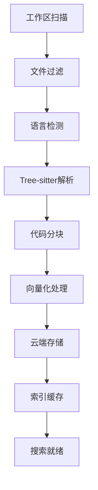

# 智能代码分块工具

一个强大的VS Code扩展，利用Tree-sitter技术智能解析和分块代码，提供语义化代码搜索和向量化存储功能。

## ✨ 主要功能

### 🔍 智能代码分块
- **多语言支持**: 支持20+种编程语言的智能解析
- **语义化分割**: 基于AST语法树进行智能代码分块
- **自适应大小**: 自动调整代码块大小，避免超出限制
- **增量处理**: 智能缓存机制，只处理变更的文件

### 🔎 智能代码搜索
- **语义搜索**: 基于代码语义而非关键词匹配
- **向量检索**: 利用嵌入向量进行精确代码定位
- **跨文件搜索**: 在整个工作区中快速定位相关代码
- **上下文理解**: 理解代码的语义上下文和意图

### 📊 性能监控
- **处理进度**: 实时显示代码分块处理进度
- **缓存统计**: 查看索引缓存使用情况
- **网络性能**: 监控和分析网络通信性能
- **详细报告**: 生成完整的性能分析报告

## 🚀 支持的编程语言

| 语言 | 解析器 | 功能状态 |
|------|--------|----------|
| JavaScript | tree-sitter-javascript | ✅ 完全支持 |
| TypeScript | tree-sitter-typescript | ✅ 完全支持 |
| Python | tree-sitter-python | ✅ 完全支持 |
| Java | tree-sitter-java | ✅ 完全支持 |
| C | tree-sitter-c | ✅ 完全支持 |
| C++ | tree-sitter-cpp | ✅ 完全支持 |
| C# | tree-sitter-c-sharp | ✅ 完全支持 |
| Go | tree-sitter-go | ✅ 完全支持 |
| Rust | tree-sitter-rust | ✅ 完全支持 |
| PHP | tree-sitter-php | ✅ 完全支持 |
| Ruby | tree-sitter-ruby | ✅ 完全支持 |
| HTML | tree-sitter-html | ✅ 完全支持 |
| CSS | tree-sitter-css | ✅ 完全支持 |

## 📦 安装

### 从源码安装

1. **克隆仓库**
   ```bash
   git clone [repository-url]
   cd codebase-client
   ```

2. **安装依赖**
   ```bash
   npm install
   ```

3. **编译扩展**
   ```bash
   npm run compile
   ```

4. **打包扩展**
   ```bash
   npm run package
   ```

5. **在VS Code中安装**
   - 打开VS Code
   - 按 `Ctrl+Shift+P` 打开命令面板
   - 输入 `Extensions: Install from VSIX...`
   - 选择生成的 `.vsix` 文件

## ⚙️ 配置

### 基本配置

在VS Code设置中配置以下选项：

```json
{
    "codeChunker.userId": "your-user-id",
    "codeChunker.deviceId": "your-device-id", 
    "codeChunker.token": "your-access-token",
    "codeChunker.ignorePatterns": [
        "node_modules/**",
        ".git/**",
        "dist/**",
        "build/**",
        "*.log"
    ]
}
```

### 配置说明

- **userId**: 用户唯一标识符
- **deviceId**: 设备唯一标识符  
- **token**: API访问令牌
- **ignorePatterns**: 忽略的文件和目录模式

## 🎯 使用方法

### 命令面板操作

按 `Ctrl+Shift+P` 打开命令面板，然后输入以下命令：

#### 代码分块操作
- **`开始代码分块`**: 开始处理当前工作区的代码
- **`查看分块进度`**: 查看当前处理进度
- **`配置代码分块器`**: 打开配置界面

#### 搜索功能
- **`智能代码搜索`**: 启动语义化代码搜索
- **`清除缓存数据`**: 清除本地缓存
- **`删除云端Collection`**: 删除远程数据集合

#### 性能监控
- **`查看索引缓存统计`**: 查看缓存使用情况
- **`生成网络性能报告`**: 生成详细性能报告
- **`清除网络性能数据`**: 清除性能监控数据

### 程序化使用

```javascript
// 手动搜索
vscode.commands.executeCommand('test-electron-treesitter.searchCode');

// 带参数搜索
vscode.commands.executeCommand('test-electron-treesitter.searchCode', 'function');

// 开始代码分块
vscode.commands.executeCommand('test-electron-treesitter.chunkCode');
```

## 🏗️ 技术架构

### 核心组件

```
智能代码分块工具
├── 📁 src/                    # VS Code扩展源码
│   ├── extension.ts           # 扩展入口点
│   ├── commands/              # 命令处理器
│   ├── services/              # 业务逻辑服务
│   └── views/                 # 用户界面组件
├── 📁 code-chunker/           # 核心分块引擎
│   ├── src/                   # 分块器源码
│   │   ├── main.js           # 主分块器类
│   │   ├── parsers/          # 语言解析器
│   │   ├── vectorManager/    # 向量管理器
│   │   └── utils/            # 工具函数
│   └── config/               # 配置管理
```

### 处理流程



### 技术栈

- **前端**: TypeScript, VS Code API
- **解析**: Tree-sitter (多语言支持)
- **向量化**: 嵌入模型 + 向量数据库
- **构建**: Webpack, ESLint, Prettier
- **测试**: Jest, VS Code Test Framework

## 🧪 开发与测试

### 开发环境

```bash
# 监听模式编译
npm run watch

# 代码格式化
npm run format

# 代码检查
npm run lint
```

### 测试

```bash
# 运行所有测试
npm test

# 运行分块器测试
npm run test:chunker

# 运行数据库测试  
npm run test:database

# 运行综合测试
npm run test:comprehensive
```

### 调试

1. 在VS Code中打开项目
2. 按 `F5` 启动调试会话
3. 在新的扩展开发主机窗口中测试功能

## 📈 性能优化

### 内存管理
- **流式处理**: 大文件采用流式读取避免内存溢出
- **批量处理**: 自动分批处理大型项目
- **垃圾回收**: 主动触发垃圾回收释放内存
- **缓存策略**: 智能缓存机制减少重复处理

### 并发处理
- **Worker线程**: 可选的多线程并行处理
- **自适应调度**: 根据系统资源动态调整并发数
- **故障隔离**: Worker异常时自动降级到同步模式

## 🛠️ 故障排除

### 常见问题

1. **配置错误**
   - 确保 `userId`、`deviceId` 和 `token` 已正确配置
   - 检查 `ignorePatterns` 是否过滤了必要文件

2. **内存问题**
   - 大型项目建议增加 Node.js 内存限制
   - 考虑调整批处理大小设置

3. **网络问题**
   - 扩展会自动清除代理设置避免连接问题
   - 检查网络连接和API端点可访问性

### 调试日志

扩展会在输出面板显示详细日志：
- 打开 `查看` > `输出`
- 选择 `代码分块器` 频道
- 查看处理过程和错误信息

### 代码规范

- 使用 TypeScript 进行类型安全开发
- 遵循 ESLint 和 Prettier 配置
- 编写单元测试覆盖新功能
- 添加详细的注释和文档


---

**智能代码分块工具** - 让代码理解更智能，搜索更精准 🚀
